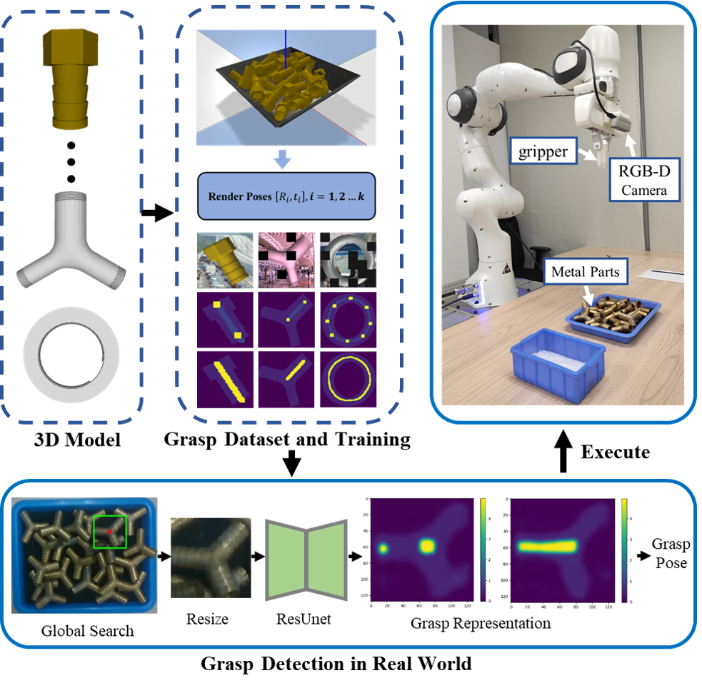
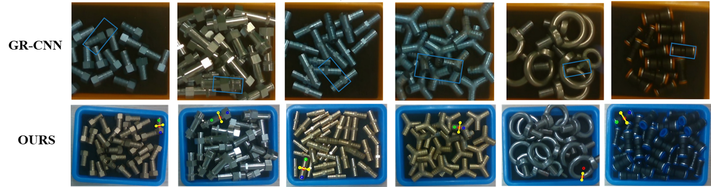
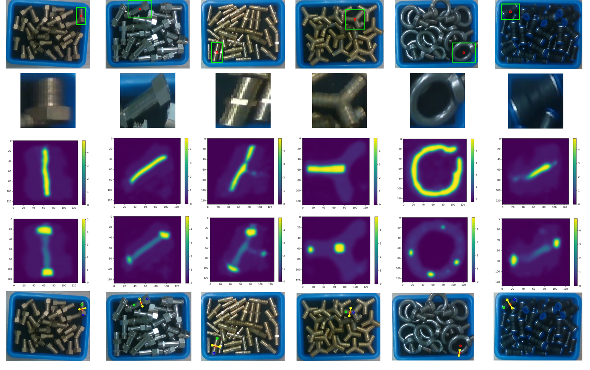
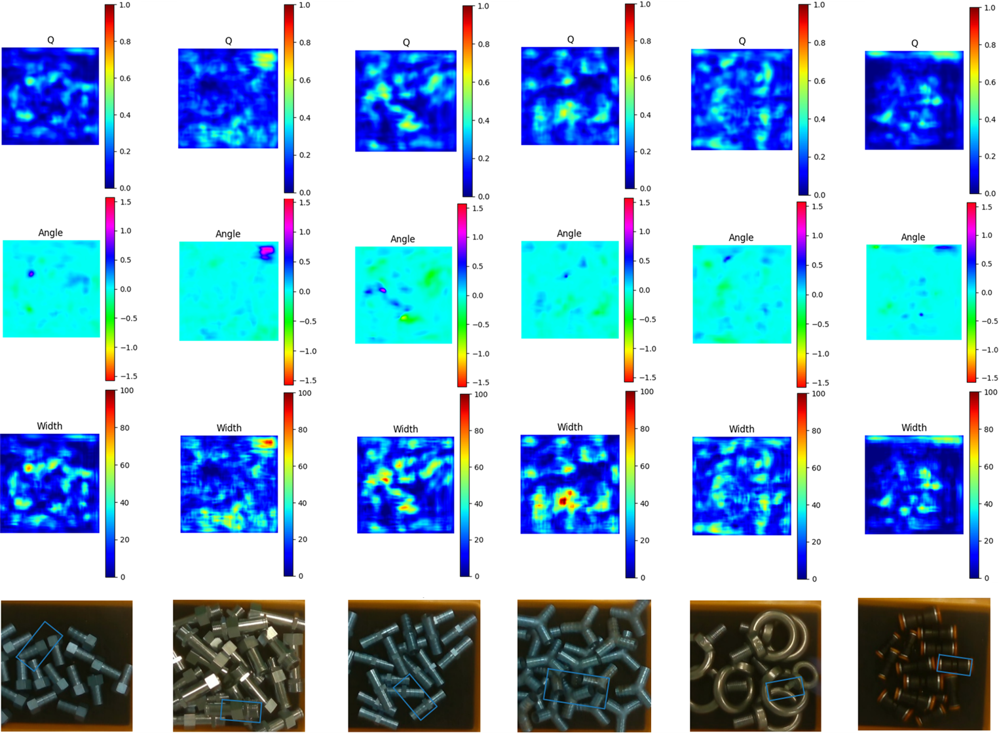
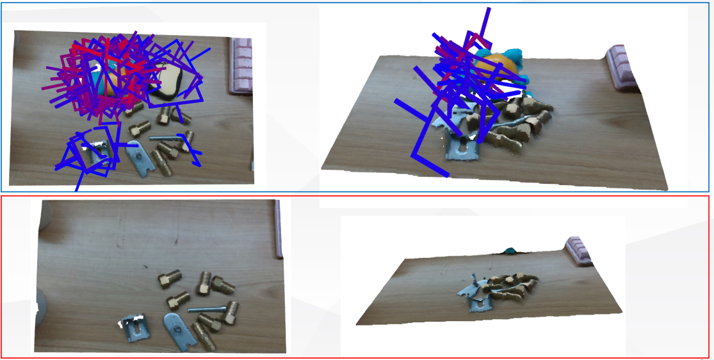
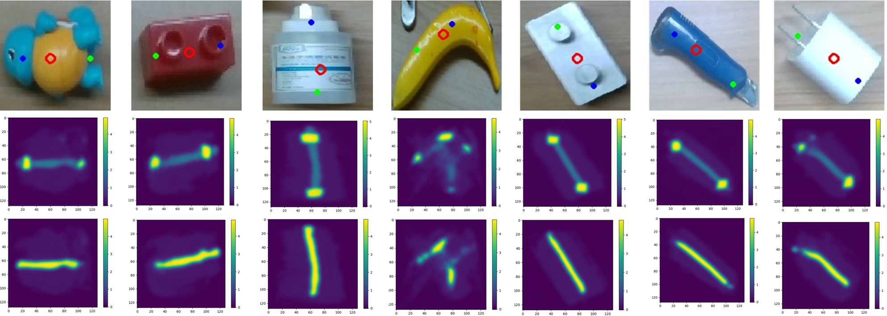

# IndusGrasp
This is the official PyTorch Implementation of **IndusGrasp: A Novel Robotic Grasp Detection Method Using Synthetic
Data for Disordered Industrial Scenarios**


## Video
- The video is available in [YouTube](https://youtu.be/lmlCMYdMw5g)

## The pipeline:

<br/>

- The Comparison studies in the real-world environment
<br/>


## Requirements: Software
  ```shell
sudo apt-get install libglfw3-dev libglfw3  

sudo apt-get install libassimp-dev   

pip install --pre --upgrade PyOpenGL PyOpenGL_accelerate 

pip install  cython cyglfw3 pyassimp==3.3 imgaug progressbar

pip install  -r requments.txt`
  ```

## Generate dataset
- Using the `tools/pybullet_dataset/pybullet_dataset.py` to create render poses with your own 3D mesh(xx.urdf)

- Using the `tools/creat_grasp.py` to create grasp representation with your own 3D mesh(xx.ply)

- Using the `dataset_generate.py` to create your dataset

## Train the IndusGrasp
`python train.py`

## Test the IndusGrasp
`python test.py `

## Comparison Studies
- Our Method  in dense scenarios

<br/>


- GR-CNN, in sparse scenarios

<br/>


- GraspNet, which doesn't work for industrial parts

<br/>

## Generalization Studies
- Our method can generate to unseen objects with different shapes and textures
(Note: the network is only trained by Synthetic Data generated by object 1. )

<br/>

